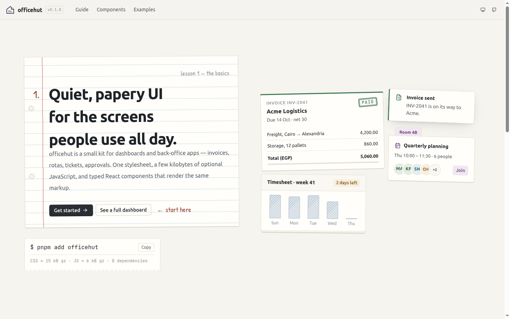

<div align="center">


# officehut

**Quiet, papery UI for the screens people use all day.**

A small UI kit for dashboards and back-office apps — invoices, rotas, tickets, approvals —<br />
dressed like a school exercise book left on an office desk.<br />
One stylesheet, a few kilobytes of optional JavaScript, and typed React components that render the same markup.

[](https://www.npmjs.com/package/officehut)
[](https://github.com/mohammed-taysser/officehut/actions/workflows/ci.yml)
[](#install)
[](#react)
[](LICENSE)

[Docs](https://officehut.vercel.app/) ·
[Components](https://officehut.vercel.app/docs/components/button) ·
[Dashboard example](https://officehut.vercel.app/examples/dashboard) ·
[Changelog](CHANGELOG.md)



</div>

---

## Why another UI kit?

Most dashboard kits are either huge (Bootstrap + a theme on top) or tied to one framework. officehut sits in between, closer to [Spectre.css](https://picturepan2.github.io/spectre/) in size and to [Tabler](https://tabler.io) in what it's for:

- **Plain CSS first.** Every component works with class names alone. JavaScript is only for things HTML can't do yet.
- **The same markup everywhere.** The React components render exactly the classes you'd write by hand, so you can mix server-rendered HTML and React on one page.
- **Its own look.** A school exercise book on an office desk — see [The school identity](#the-school-identity) below. No gradients, no glass, no stock-template feel.
- **Built for long sessions.** 14px base text, tabular numbers, a "night shift" theme, a compact density, and right-to-left support out of the box.

|                              | officehut  | Tabler        | Spectre.css |
| ---------------------------- | ---------- | ------------- | ----------- |
| Depends on                   | nothing    | Bootstrap 5   | nothing     |
| CSS, everything (min + gzip) | ≈ 32 kB    | ≈ 70 kB       | ≈ 10 kB     |
| CSS, core + a few components | ≈ 12–15 kB | —             | —           |
| Vanilla JS behaviours        | ✓ (≈ 6 kB) | via Bootstrap | —           |
| Typed React components       | ✓          | community     | —           |
| Dark theme / RTL             | ✓ / ✓      | ✓ / ✓         | — / —       |

<sub>Sizes are approximate; run `pnpm size` for exact numbers.</sub>

---

## The school identity

Most admin kits look like the same template. officehut borrows its look from the two places most people learned to keep records: **the school exercise book** and **the office desk**. Everything still behaves like a modern UI; the paper is in the details.

<table>
<tr><th align="left">From school</th><th align="left">In the kit</th><th align="left">Used for</th></tr>
<tr><td>Exercise book — blue ruled lines, red margin, punched holes</td><td><code>.notebook</code>, <code>&lt;Notebook&gt;</code></td><td>Forms, notes, page intros. Text and inputs snap to the ruling so they sit <em>on</em> the lines.</td></tr>
<tr><td>Squared maths paper</td><td><code>.notebook-squared</code>, <code>.bg-grid</code></td><td>Scratch areas, empty states, chart backgrounds</td></tr>
<tr><td>Writing in the margin</td><td><code>.notebook-margin</code>, <code>.handwriting</code></td><td>Lesson numbers, short remarks, "see me" notes. Handwriting is only ever used for small annotations.</td></tr>
<tr><td>Teacher's red pen</td><td><code>&lt;Grade&gt;</code>, <code>.underline-wavy</code>, <code>.circled</code>, <code>.strike-pen</code></td><td>Vendor ratings, QA scores, review marks, "check this"</td></tr>
<tr><td>Highlighter</td><td><code>&lt;Marker&gt;</code>, <code>.highlight</code></td><td>Key terms in contracts, the active page in a sidebar</td></tr>
<tr><td>Homework checklist</td><td><code>&lt;Checklist&gt;</code></td><td>Month-end close, onboarding. A pen tick overshoots the box; done items are struck through.</td></tr>
<tr><td>Class timetable</td><td><code>&lt;Timetable&gt;</code></td><td>Shift rotas, room bookings, training weeks</td></tr>
<tr><td>Chalkboard</td><td><code>&lt;Chalkboard&gt;</code>, code blocks in the docs</td><td>Today's agenda, stand-up notes, code. No lines behind the text, so it stays readable.</td></tr>
<tr><td>Gold stars & stickers</td><td><code>&lt;Sticker&gt;</code></td><td>"Approved", "Top seller", "Employee of the month"</td></tr>
<tr><td>Noticeboard, push pins, paper clips</td><td><code>&lt;Corkboard&gt;</code>, <code>&lt;Pinned&gt;</code>, <code>.clipped</code></td><td>Announcements; "has attachments"</td></tr>
<tr><td>Sticky notes</td><td><code>&lt;Sticky&gt;</code></td><td>Comments on a document, reminders</td></tr>
<tr><td>Binder dividers</td><td><code>Tabs variant="index"</code> + <code>.binder</code></td><td>Handbooks, long settings pages</td></tr>
<tr><td>Tear-off desk calendar</td><td><code>&lt;DateTile&gt;</code></td><td>Due dates, events</td></tr>
<tr><td>A pencil writing</td><td><code>&lt;PencilLoader&gt;</code></td><td>Loading states (still drawing under <code>prefers-reduced-motion</code>)</td></tr>
<tr><td>A page marked "see me"</td><td><code>&lt;ErrorBoundary&gt;</code>, <code>.error-sheet</code></td><td>Crashed pages and widgets, with retry</td></tr>
</table>

And from the **office desk**: rubber stamps (`PAID`, `OVERDUE`) as badges, manila folder tabs on cards and tabs, stacked paper, ledger tables with a red double rule, masking-tape ribbons, receipts.

A few rules keep it from becoming a costume:

- **Readability first.** Paper effects sit at the edges (margins, headers, tabs). Long text and code never have lines behind them.
- **Handwriting is seasoning.** Patrick Hand is used for a few words at a time — never for body copy, labels or buttons.
- **Night shift is the same book under a desk lamp**: charcoal paper, faint ruling, softer ink. Every component is designed in both themes.
- **Real content.** Demos use invoices, rotas and leave requests — never lorem ipsum.

---

## Install

### From a CDN — no build step

```html
<link
  rel="stylesheet"
  href="https://unpkg.com/officehut/dist/css/officehut.min.css"
/>
<script src="https://unpkg.com/officehut/dist/officehut.iife.js" defer></script>
```

The script wires up every `data-oh-*` attribute on the page and exposes `window.Officehut`.

### From npm

```bash
pnpm add officehut     # or npm i officehut / yarn add officehut
```

| Import                                                           | What you get                                                            |
| ---------------------------------------------------------------- | ----------------------------------------------------------------------- |
| `officehut/css`                                                  | The whole kit, compiled (`officehut/css/min` for minified)              |
| `officehut/css/core.css` + `officehut/css/components/<name>.css` | Just the parts you use                                                  |
| `officehut/scss`                                                 | Sass source, configurable with `@use … with (…)`                        |
| `officehut`                                                      | Vanilla JS: `initAll()`, `toast()`, `Modal`, `Dropdown`, theme helpers… |
| `officehut/react`                                                | React 19 components and hooks                                           |
| `officehut/tokens`                                               | Colour / size / breakpoint constants for your own code                  |

---

## Use it

### Plain HTML

```html
<div class="card">
  <div class="card-status-top bg-success"></div>
  <div class="card-body">
    <span class="eyebrow">Invoice INV-2041</span>
    <h3 class="card-title">Acme Logistics</h3>
    <span class="badge badge-success badge-stamp">Paid</span>
  </div>
</div>

<div class="dropdown">
  <button class="btn dropdown-toggle" data-oh-toggle="dropdown">Export</button>
  <div class="dropdown-menu">
    <button class="dropdown-item">
      CSV <kbd class="dropdown-shortcut">⌘E</kbd>
    </button>
    <button class="dropdown-item">PDF</button>
  </div>
</div>

<button
  class="btn btn-primary"
  data-oh-toggle="modal"
  data-oh-target="#new-invoice"
>
  New invoice
</button>
<dialog class="modal" id="new-invoice">…</dialog>
```

### Vanilla JS with a bundler

```js
import 'officehut/css';
import { initAll, toast } from 'officehut';

initAll(); // one delegated listener; elements added later just work

toast({
  title: 'Invoice sent',
  message: 'INV-2041 to Acme Logistics',
  color: 'success',
});
```

Every behaviour fires cancelable `oh:*` events (`oh:show`, `oh:hide`, `oh:change`, `oh:dismiss`…) and has a class API — `new Officehut.Modal(dialog).show()`.

### React

```tsx
import 'officehut/css';
import { Badge, Button, Card, Dropdown } from 'officehut/react';

export function InvoiceCard() {
  return (
    <Card status='success'>
      <Card.Body>
        <span className='eyebrow'>Invoice INV-2041</span>
        <Card.Title>Acme Logistics</Card.Title>
        <Badge color='success' variant='stamp'>
          Paid
        </Badge>
      </Card.Body>
      <Card.Footer>
        <Dropdown trigger={<Button size='sm'>Export</Button>}>
          <Dropdown.Item shortcut='⌘E'>CSV</Dropdown.Item>
          <Dropdown.Item>PDF</Dropdown.Item>
        </Dropdown>
      </Card.Footer>
    </Card>
  );
}
```

Props are typed from shared unions (`Color`, `Size`, `Placement`…), refs are plain props (React 19), and polymorphic components accept `as` — e.g. `<Button as={Link} to="/invoices">`.

---

## Make it yours

### CSS variables (runtime)

```css
:root {
  --oh-primary: #0b6e4f;
  --oh-radius: 3px;
  --oh-font-sans: 'Inter', system-ui, sans-serif;
}
```

Soft tints, borders and hover shades are derived with `color-mix()`, so changing one colour updates its whole family.

### Sass (build time)

```scss
@use 'officehut/scss' with (
  $colors: (
    'primary': #0b6e4f,
    'brand': #e4572e,
  ),
  $radius: 3px,
  $enable-utilities: false
);
```

### Themes & density

```html
<html data-oh-theme="auto">
  <!-- light | dark | auto -->
  <section data-oh-theme="dark">…</section>
  <!-- scope a theme to one area -->
  <main data-oh-density="compact">…</main>
  <!-- tighter controls for data screens -->
</html>
```

---

## What's inside

**Layout** — container, 12-column grid, CSS-grid helpers (`.grid.cols-md-3`, `.grid-auto`), stacks, app shell, page header, utilities (logical, responsive).

**Paper & school** — notebook · sticky note · marker · grade · sticker · timetable · corkboard & pins · checklist · date tile · chalkboard · binder tabs · pencil loader · error sheet & boundary.

**Components** — accordion · alert · avatar · badge (incl. rubber stamps) · breadcrumb · button · card (folder tab, stacked, clipped) · checkbox & radio · chip · collapse · divider · dropdown · empty state · input & input group · kbd · modal & drawer · navbar · pagination · progress · ribbon · sidebar · skeleton · spinner · stat & sparkline · status · steps · switch · table (incl. ledger) · tabs · timeline · toast · tooltip · tracking.

See the [component status table in the docs](https://officehut.vercel.app/docs) for which ones have vanilla behaviours and React bindings.

---

## Accessibility

- Keyboard support follows the WAI-ARIA patterns: arrow keys in menus and tabs, Esc to close, focus returned to the trigger.
- Modals use the native `<dialog>` element (real focus trapping and top layer); accordions use `<details>`.
- Visible `:focus-visible` rings, `prefers-reduced-motion` respected (the pencil loader stops writing, stamps stop thudding), every test suite runs axe-core.
- School decorations are decorative: stamps, stickers and ribbons repeat their meaning in text, grades have spoken labels ("9 out of 10"), checklists are real checkboxes.
- You still need to label icon-only buttons and write meaningful link text — the docs point out where.

## Browser support

The last two versions of Chrome, Edge, Firefox and Safari. The kit relies on `color-mix()`, `:has()`, `<dialog>` and logical properties; `interpolate-size` (accordion animation) is a progressive enhancement.

---

## Development

```bash
corepack enable
pnpm install
pnpm dev          # docs site with hot reload
pnpm test         # vitest + testing-library + axe
pnpm build        # dist/: css, js, react, iife, types
pnpm verify       # everything CI runs
pnpm playground   # build, then open the plain-HTML playground
```

```
src/
  scss/        the CSS kit (config, abstracts, base, layout, components, utilities)
  js/          vanilla behaviours + data-oh-* API
  react/       React components and hooks
  shared/      tokens, cx, positioning, focus helpers
docs/          documentation site (Vite + React Router)
playground/    plain HTML page using the built files
tests/         test setup, axe helper
```

Read [CONTRIBUTING.md](CONTRIBUTING.md) before opening a pull request — it has the checklist for adding a component. Deploying the docs (Vercel, GitHub Pages) and publishing to npm are covered in [docs/DEPLOYMENT.md](docs/DEPLOYMENT.md).

## Credits

officehut started as a React rebuild of ideas from [Tabler](https://tabler.io) and took its "small and dependency-free" stance from [Spectre.css](https://picturepan2.github.io/spectre/). Icons in the docs come from [Tabler Icons](https://tabler.io/icons). The school look owes a lot to every exercise book that ever got a red "see me" in the margin. Fonts: [Ubuntu](https://design.ubuntu.com/font), [JetBrains Mono](https://www.jetbrains.com/lp/mono/) and [Patrick Hand](https://fonts.google.com/specimen/Patrick+Hand).

## License

[MIT](LICENSE) © Mohammed Taysser
